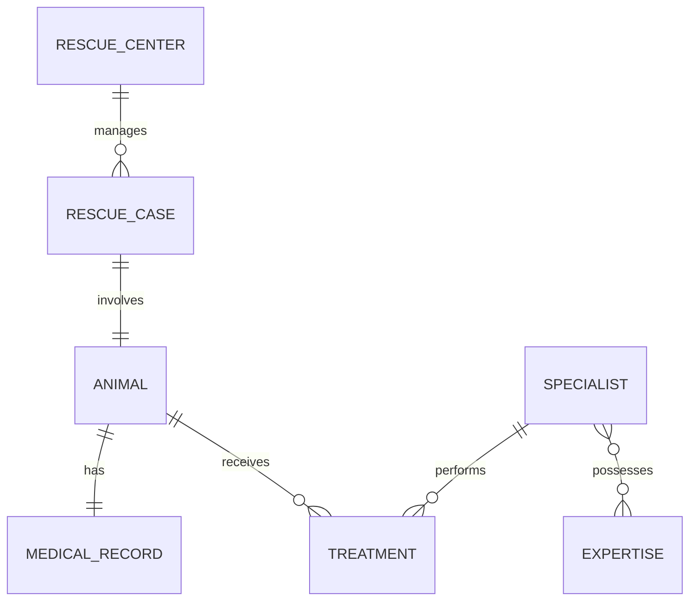

# DeepBlue Rescue

Proyecto de persistencia para una plataforma de rescate y rehabilitacion de fauna marina. El objetivo del laboratorio es trabajar el recorrido completo entre el modelo relacional, migraciones Flyway, entidades JPA, repositories y pruebas de integracion contra PostgreSQL real.

## Tecnologias

- Java 21
- Spring Boot 4.1.x
- Spring Data JPA
- Hibernate
- PostgreSQL
- Flyway
- Testcontainers
- Maven

## Modelo de datos



Tablas principales:

- `rescue_centers`
- `rescue_cases`
- `animals`
- `medical_records`
- `specialists`
- `expertise`
- `treatments`

Tabla asociativa:

- `specialist_expertise`

## Relaciones

- `RescueCenter 1:N RescueCase`
- `RescueCase 1:1 Animal`
- `Animal 1:1 MedicalRecord`
- `Specialist N:M Expertise`
- `Animal 1:N Treatment`
- `Specialist 1:N Treatment`

Las relaciones 1:1 se refuerzan en PostgreSQL con una restriccion `UNIQUE` sobre la clave foranea correspondiente.

## Flyway

Flyway es el responsable de crear y evolucionar el esquema. Hibernate esta configurado con:

```yaml
spring:
  jpa:
    hibernate:
      ddl-auto: validate
```

Por eso Hibernate valida el esquema, pero no crea ni actualiza las tablas.

Migraciones:

- `V1__create_schema.sql`: crea tablas, constraints e indices.
- `V2__insert_expertise_catalog.sql`: carga el catalogo inicial de especialidades.
- `V3__add_tracking_device_to_animal.sql`: agrega `tracking_device_code` a `animals`.

## Query Methods

Entre los Query Methods implementados estan:

- `RescueCenterRepository.findByCode(...)`
- `RescueCaseRepository.findByCaseCode(...)`
- `RescueCaseRepository.findByStatusOrderByRescueDateAsc(...)`
- `RescueCaseRepository.findByRescueCenterCode(...)`
- `RescueCaseRepository.findByRescueDateAfterOrderByRescueDateDesc(...)`
- `AnimalRepository.findByAnimalCode(...)`
- `AnimalRepository.findByCommonNameContainingIgnoreCase(...)`
- `AnimalRepository.findByRescueCaseStatus(...)`
- `AnimalRepository.findByRescueCaseRescueCenterCode(...)`
- `ExpertiseRepository.findByNameIgnoreCase(...)`
- `TreatmentRepository.findByAnimalIdOrderByPerformedAtAsc(...)`

## Consultas JPQL

Se implementaron consultas JPQL para:

- especialistas activos segun expertise;
- tratamientos entre dos fechas;
- tratamientos realizados a animales de un centro;
- tratamientos hechos por especialistas con determinada expertise;
- animales en un estado concreto que hayan recibido tratamiento de un especialista con determinada expertise.

## Ejecutar la aplicacion

Para ejecutar la aplicacion se necesita PostgreSQL disponible. Por defecto se intenta conectar a:

```text
jdbc:postgresql://localhost:5432/deepblue
```

Usuario y clave por defecto:

```text
postgres / postgres
```

Tambien se pueden usar las variables de entorno `DB_URL`, `DB_USER` y `DB_PASSWORD`.

En Windows:

```bash
mvnw.cmd spring-boot:run
```

En Linux/macOS:

```bash
./mvnw spring-boot:run
```

## Ejecutar los tests

Los tests usan Testcontainers, por lo que Docker Desktop debe estar iniciado.

Windows:

```bash
mvnw.cmd clean test
```

Linux/macOS:

```bash
./mvnw clean test
```

Durante la ejecucion Testcontainers levanta temporalmente PostgreSQL 18 Alpine con la base `deepblue_test`. `@ServiceConnection` entrega la conexion al contexto de Spring Boot y, al finalizar las pruebas, el contenedor se elimina.

En otra terminal se puede ejecutar:

```bash
docker ps
```

para observar el contenedor mientras los tests estan corriendo.

## Pruebas incluidas

`PersistenceIntegrationIT` comprueba, entre otras cosas:

- ejecucion de migraciones Flyway;
- metodos heredados de `JpaRepository`;
- relaciones 1:N, 1:1 y N:M;
- Query Methods simples y con navegacion de asociaciones;
- consultas JPQL;
- orden cronologico de tratamientos;
- busqueda por intervalo de fechas;
- constraints `UNIQUE`, `FOREIGN KEY` y `CHECK` de PostgreSQL;
- escenario integrador de DeepBlue Caribbean;
- reto final de animales en rehabilitacion tratados por especialistas con experiencia en Trauma.
